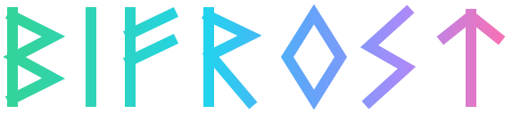
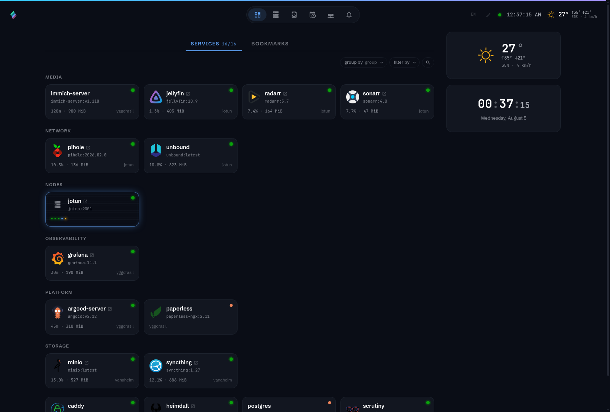
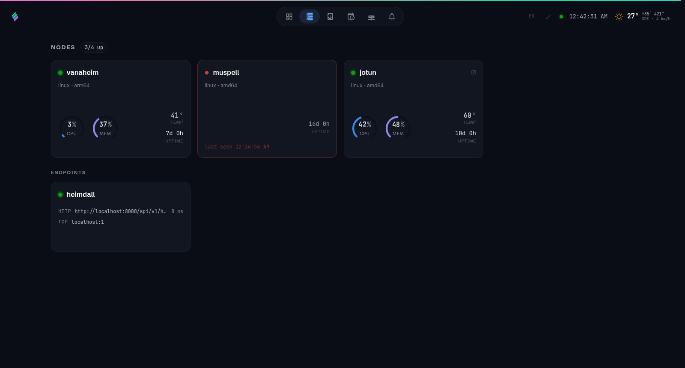
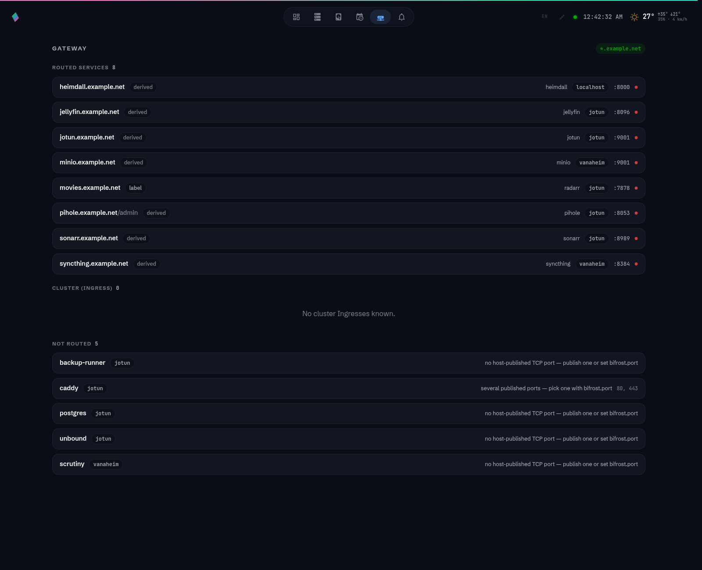
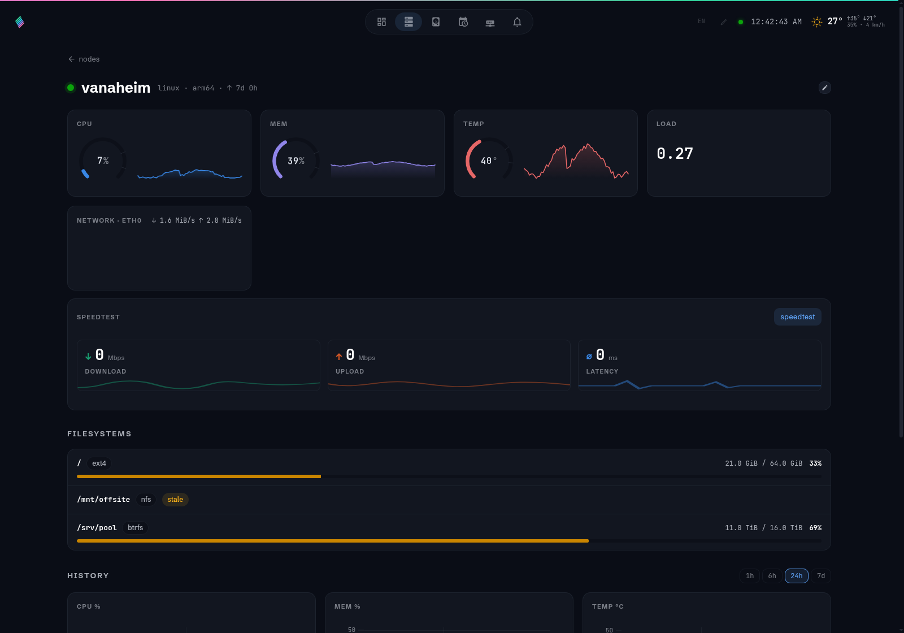
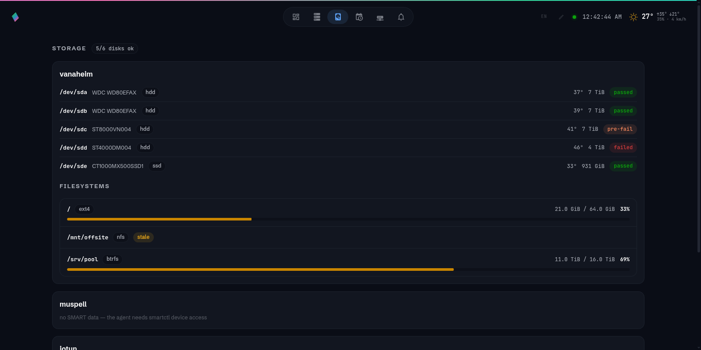

<p align="center">
  
</p>
<p align="center">
  
</p>

<h3 align="center" style="font-size: 25px;"><em>The bridge between you and your homelab.</em></h3>

**Bifrost** is a self-hosted homelab dashboard built around two containers:

- **`bifrost-hub`** — FastAPI + SQLite + a Vue 3 SPA. Receives agent reports, stores state
  and metric history, and serves the dashboard.
- **`bifrost-agent`** — a tiny static Go binary (alpine + smartmontools image). One per node.
  Collects system metrics, discovers local Docker containers, reads disk SMART health, and
  detects Kubernetes clusters running on the node.

Agents connect **outbound** to the hub over a persistent WebSocket: no open ports on your
nodes, and node-down detection is instant (socket close + application heartbeat).

## Features

- **Live nodes** — CPU, memory, load, network, temperatures streamed in real time; history
  at three resolutions (raw/1m/1h); per-node filesystems and SMART disk health.
- **Docker services** — every container on every node becomes a dashboard card with live
  state, health, usage, an auto-resolved icon and (usually) a working URL. Zero labels
  needed in the common case.
- **Kubernetes** — clusters are auto-detected by the agent; Ingresses, Services and
  CronJobs (with run history) appear alongside Docker services.
- **Gateway** — bifrost derives one `https://<name>.<your-domain>` URL per service and
  publishes the routing table for your reverse proxy to consume. A Caddy + sidecar example
  makes the whole homelab reachable with wildcard TLS ([examples/gateway](examples/gateway/README.md)).
- **Endpoints** — agentless nodes (HAOS boxes, printers, routers) monitored by hub-side
  http/tcp/ping checks, with latency history — and routed like any other service.
- **Node UIs** — NAS portals and similar get their own card, a link on the node, a derived
  route and their real favicon.
- **Service health checks** — routed URLs are probed every minute: status, latency and TLS
  certificate expiry (warning at ≤ 14 days).
- **Image update watch** — running tags are compared against ghcr.io and Docker Hub every
  6 h; cards grow a quiet package glyph when a newer semver tag exists.
- **Speedtest** — per-node download/upload/latency, run by the agent on demand.
- **Alerts** — rules by event kind and severity, delivered via ntfy, webhook or Telegram,
  with cooldowns and a test button.
- **Bookmarks & widgets** — YAML-synced bookmarks and an ambient rail (clock, weather,
  Home Assistant entities).
- **The details** — dark-first hand-built design system, CSS-only animations, EN/ES,
  drag-to-reorder edit mode, status as dots + tooltips everywhere.

## A look around

Screenshots from a local dev stack seeded with synthetic data (`./dev.sh --seed`):

<p align="center">
  
</p>
<p align="center">
  
  
</p>
<p align="center">
  
  
</p>

## Quick start

```sh
# Hub (one instance, anywhere)
docker compose -f examples/docker-compose.hub.yml up -d

# Agent (one per node)
docker compose -f examples/docker-compose.agent.yml up -d
```

Set `BIFROST_ENROLL_TOKEN` on the hub and `BIFROST_AGENT_ENROLL_TOKEN` +
`BIFROST_AGENT_HUB_URL` on each agent. That's it — nodes appear in the dashboard as they
connect.

## How discovery works

### Docker services

The agent mounts `docker.sock` read-only and keeps the hub current three ways: a full
container list on connect, the Docker **event stream** (start/die/health) for instant card
updates, and periodic **stats** samples (CPU/mem per container). Containers with no
routable port (databases, workers) still get cards — they just don't get URLs.

For containers running with `network_mode: host` the agent additionally inspects the
image's `EXPOSE` list: those ports are listening on the host itself, so they count as
routable — no labels needed for things like NAS backup daemons.

### Kubernetes

The agent recognizes k3s / kubeadm / k0s on the node and hands the hub a kubeconfig when
it can read one. The hub then talks to the API server directly: **Ingresses** define
service URLs, **Services** map workloads, **CronJobs** feed the Jobs view with run
history. System namespaces (`kube-system`, `argocd`, `cert-manager`, …) are hidden by
default; per-workload annotations (below) tune the rest.

### Route derivation (the zero-label philosophy)

Set one variable on the hub and every service gets a URL by convention:

```yaml
environment:
  BIFROST_SERVICE_DOMAIN: example.net
```

| Source | Rule | Route |
|---|---|---|
| Docker container | exactly one published TCP port (or `EXPOSE` on host-net) | `https://<container>.example.net` → `node:port` |
| Docker container | several ports | excluded until you pick one with `bifrost.port` |
| k8s Ingress | its real host | already routed by the cluster; shown, never overridden |
| Endpoint node | its http/tcp check target | `https://<endpoint>.example.net` → `target host:port` |
| Agent node with a UI | `ui_port` | `https://<node>.example.net` → `node:ui_port` |

Conflict rules, in order: **hand-written proxy vhosts always win** (the sync skips their
hostnames) → **explicit `bifrost.url` beats convention** → **derived names yield to k8s
Ingress hosts** → duplicate hostnames keep the first claimant and the rest are excluded.
The **Gateway view** shows every routed service (with live check status), every cluster
Ingress, and every excluded container *with the reason*, so nothing fails silently.

Labels are the escape hatch, not the requirement:

| Docker label / k8s annotation | Effect |
|---|---|
| `bifrost.url` | explicit URL — wins over everything |
| `bifrost.port` | pick the routable port when several are published |
| `bifrost.path` | redirect `/` to a subpath (e.g. `/admin/`) |
| `bifrost.expose` | `false` opts out of routing |
| `bifrost.hide` | hide the card from the dashboard |
| `bifrost.name` / `bifrost.icon` / `bifrost.group` | card cosmetics |

On Kubernetes the routing half is the Ingress's job; the cosmetic ones
(`bifrost.name/icon/group/hide`) work as annotations on the workload.

The hub publishes the result at `GET /api/v1/gateway/routes?domain=<domain>` — a stable,
minimal feed (host/node/port/path) meant for reverse-proxy sync.
[examples/gateway](examples/gateway/README.md) ships a Caddy setup with a `caddy-sync`
sidecar: wildcard DNS record, DNS-01 wildcard certs, generated handle blocks hot-reloaded
through Caddy's admin API, and a catch-all fallthrough (e.g. to a k8s ingress controller).

### Endpoints (agentless nodes)

Some things can't run an agent. Add them as **endpoints** (Nodes → Endpoints, in edit
mode, or `POST /api/v1/nodes/endpoints`) with an `http`, `tcp` or `ping` check. The hub
probes them, keeps latency history, alerts on transitions — and because the check target
names a host and port, the endpoint joins the gateway feed like any container.

### Node UIs

A node whose OS has a web portal (NAS boxes, routers) can declare it:

```yaml
environment:
  BIFROST_AGENT_UI_PORT: "9999"        # → http://<node>:9999
  # or the full thing, if port alone isn't enough:
  BIFROST_AGENT_UI_URL: https://nas.example.net
```

(Also settable from the node detail view or `PATCH /api/v1/nodes/{uuid}`; agent env wins —
it's declarative config.) The node then gets: a link on its node card and detail header, a
machine-styled card in the dashboard's **nodes** group (front-panel LEDs driven by the
node's real CPU and network telemetry), a derived gateway route, and its portal's actual
favicon — the hub fetches `/favicon.svg|ico|png`, `apple-touch-icon.png`, then falls back
to parsing the portal's `<link rel="icon">`.

## Configuration

Hub (`BIFROST_*`):

| Variable | Default | Purpose |
|---|---|---|
| `ENROLL_TOKEN` | `change-me` | shared secret agents enroll with |
| `AUTO_APPROVE` | `true` | auto-approve enrolling nodes |
| `SERVICE_DOMAIN` | *(empty)* | enables URL derivation + gateway feed |
| `TELEGRAM_BOT_TOKEN` | *(empty)* | for the `telegram` alert notifier (rule target = chat id) |
| `DATA_DIR` | `/data` | SQLite + bookmarks location |
| `BOOKMARKS_FILE` | `<data>/bookmarks.yml` | declarative bookmarks, synced both ways |
| `METRICS_INTERVAL_S` … | `10/60/1800` | agent cadences, pushed on connect |

Agent (`BIFROST_AGENT_*`):

| Variable | Purpose |
|---|---|
| `HUB_URL` | where the hub lives (required) |
| `ENROLL_TOKEN` | must match the hub (required) |
| `NODE_NAME` | override the hostname |
| `UI_PORT` / `UI_URL` | declare the node's own web UI |
| `SPEEDTEST_URL` | download target for the speedtest (pick a mirror near you) |
| `METRICS_INTERVAL` | local sampling override |

## Design principles

- **Infrastructure-agnostic.** Any mix of bare Docker hosts, NAS boxes, Raspberry Pis and
  Kubernetes clusters. Bifrost adapts to what it finds.
- **Push, not pull.** Agents dial the hub. Nodes never expose anything.
- **Zero labels by default.** Convention derives the URL; labels exist only for the
  exceptions.
- **Open by design.** The dashboard has no authentication — protect it at the network layer
  (Tailscale, reverse proxy). Agent enrollment is token-authenticated.
- **One binary, one socket, zero state.** Agents are stateless; identity derives from the
  host machine-id fingerprint.
- **Beautiful on purpose.** A hand-built design system, CSS-only animations, dark-first.

## Repository layout

```
hub/       Python 3.13 · FastAPI · SQLAlchemy 2 · Alembic · uv
agent/     Go · gopsutil · coder/websocket
frontend/  Vue 3 · Vite · TypeScript · Pinia · Tailwind 4 · Storybook
docker/    Multi-arch Dockerfiles (amd64 + arm64)
examples/  docker-compose examples, gateway (Caddy + sync), k8s RBAC
docs/      Architecture, protocol, agent, k8s, roadmap
```

## Development

```sh
# Hub
cd hub && uv sync && uv run uvicorn app.asgi:app --reload

# Agent (requires Go, or use the Docker builder)
cd agent && go run ./cmd/bifrost-agent

# Frontend
cd frontend && npm install && npm run dev
```

## License

MIT
